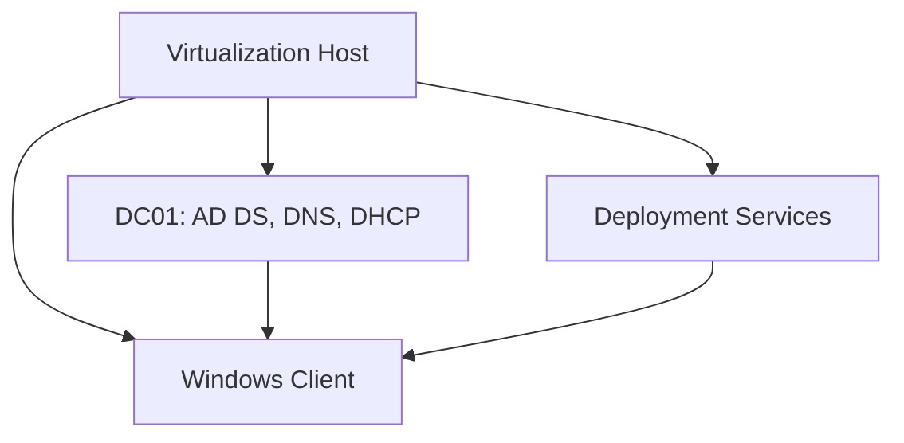

# Windows Server 2022 Home Lab

## Overview

This educational home lab documents a small Windows domain environment built to practise junior systems administration and desktop-support workflows. It covers identity, name resolution, addressing, policy, client onboarding, and structured troubleshooting.

## Technologies

- Windows Server 2022
- Active Directory Domain Services
- DNS and DHCP
- Group Policy
- Windows Deployment Services and PXE concepts
- Windows 10/11 client
- VMware virtualization

## Lab architecture

## Build process

1. Created the virtual network and assigned planned server addresses.
2. Installed Windows Server and promoted the domain controller.
3. Created organizational units, users, groups, and role-based membership.
4. Configured DNS and a DHCP scope for the client network.
5. Created and tested Group Policy settings for account and workstation management.
6. Joined a Windows client to the domain and verified sign-in and policy application.
7. Practised deployment-service and PXE workflows in the isolated lab.

## Validation

- Confirmed domain name resolution from the client.
- Verified DHCP addressing, gateway, and DNS options.
- Tested domain join and user sign-in.
- Checked Group Policy with `gpupdate` and `gpresult`.
- Reviewed Event Viewer when diagnosing policy and service issues.
- Confirmed users and groups were placed in the intended organizational units.

## Troubleshooting example

A deliberately introduced Group Policy conflict was isolated by checking policy scope, security filtering, `gpresult` output, and related event logs. The correction was applied and the policy was retested from the client.

## Evidence plan

The repository currently focuses on the build and validation notes. The next evidence update should add genuine, sanitized screenshots of:

- Active Directory Users and Computers
- DNS zones and DHCP scope
- Group Policy Management
- Client domain membership and `gpresult`
- WDS/PXE validation

No placeholder image should be treated as proof of a completed step.

> Scope note: This is a self-managed lab environment, not production infrastructure.
