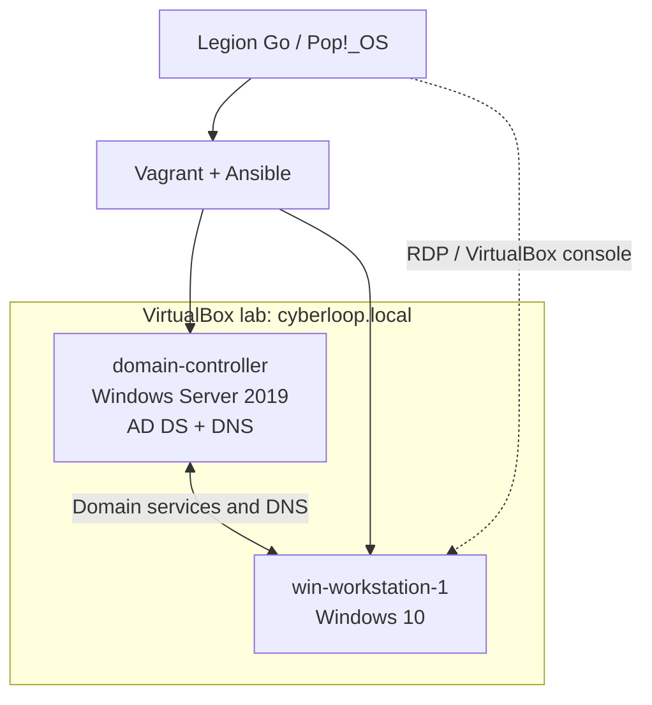
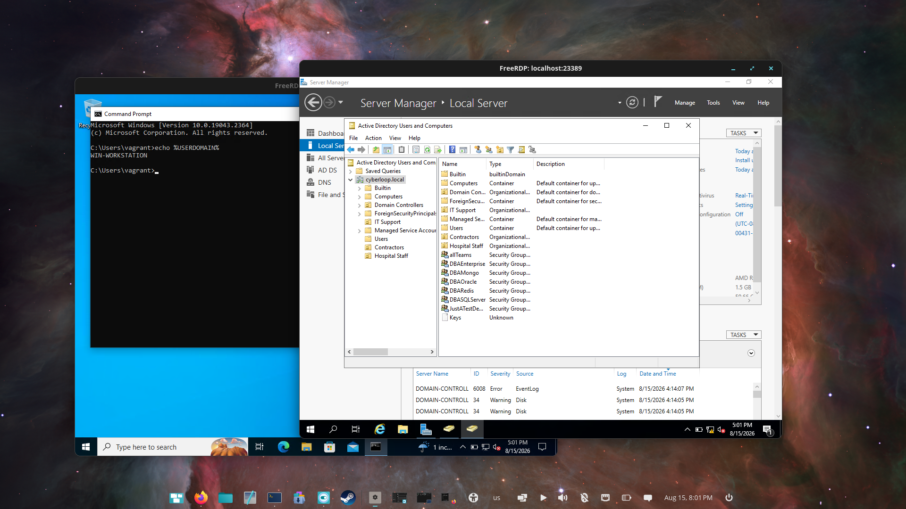

# Windows Server & Active Directory Home Lab

**Bibek Maharjan** | Windows Server 2019 · Windows 10 · VirtualBox · Vagrant · Ansible

I built a two-VM Active Directory lab on a Pop!_OS host to practice Windows administration and IT support troubleshooting. The lab includes the `cyberloop.local` domain, a Windows Server domain controller, a domain-joined workstation, users and groups, a custom OU structure, and Group Policy configuration.

**Current status:** Core domain and workstation join completed; OUs and a GPO configured; domain password-policy verification and an RDP login investigation remain open.

## Lab at a glance

| Component | Configuration |
| --- | --- |
| Host | Lenovo Legion Go, Pop!_OS; 16 GB installed, about 12 GiB reported usable |
| Virtualization | VirtualBox, managed with Vagrant |
| Provisioning | Ansible, adapted from [alebov/AD-lab](https://github.com/alebov/AD-lab) |
| Domain controller | Windows Server 2019; `domain-controller`; AD DS and DNS |
| Workstation | Windows 10; `win-workstation-1.cyberloop.local` |
| Domain | `cyberloop.local` |
| VM resources | 1536 MB RAM and 2 vCPUs per VM, as recorded in the build notes |
| Administration | AD Users and Computers, Group Policy Management, PowerShell, FreeRDP |

## Architecture

[Architecture and access notes](diagrams/README.md)

## Walk through the project

| Milestone | Work performed | Documentation |
| --- | --- | --- |
| 01 · Environment | Reduced a five-VM configuration to two VMs to fit host memory | [Setup and resource decisions](documentation/01-environment-setup.md) |
| 02 · Domain controller | Provisioned AD DS/DNS and worked through Ansible, PowerShell and Chocolatey compatibility issues | [Build and provisioning fixes](documentation/02-domain-controller.md) |
| 03 · Domain join | Joined Windows 10 to `cyberloop.local` and checked System Properties | [Workstation verification](documentation/03-workstation-domain-join.md) |
| 04 · Users, groups and OUs | Created IT Support, Hospital Staff and Contractors OUs; added a test user; queried AD | [Directory administration](documentation/04-users-groups-and-ous.md) |
| 05 · Group Policy | Linked a GPO, configured password/lockout settings and inspected `gpresult` | [Configuration and verification limits](documentation/05-group-policy.md) |
| 06 · Troubleshooting | Investigated domain-user RDP failures and demonstrated console sign-in | [RDP case study and next checks](documentation/06-rdp-troubleshooting.md) |

Each walkthrough includes the steps, supporting screenshots, outcome and lessons learned. [Browse all 23 screenshots](screenshots/README.md), or [download the original screenshot collection (PDF)](documentation/ad-lab-screenshot-collection.pdf).

## Selected evidence

### Workstation joined to the domain

### Custom organizational units

### Domain-user console sign-in

The console sign-in is a useful troubleshooting result; the RDP issue remains unresolved.

## Skills demonstrated

- Sizing a virtual lab to fit available hardware resources.
- Deploying a domain controller and joining a Windows workstation.
- Working with AD users, groups, OUs and PowerShell queries.
- Creating and linking a GPO, and distinguishing configured settings from verified effective policy.
- Diagnosing provisioning failures and recording version-specific workarounds.
- Comparing console and remote login behavior during an access investigation.

## Lessons learned and remaining work

- Older automation can require compatibility work. The recorded version pins describe this build, not a current deployment baseline.
- An ignored task is still unfinished work: the DNS forwarder task was bypassed, not repaired.
- A local-account `gpresult` capture does not verify domain-user policy, and an OU-linked password-policy GPO does not establish a separate password policy for domain users.
- Successful console sign-in helps narrow an RDP investigation but does not identify its root cause.

Next steps are to capture `dcdiag` and provisioning recaps, verify effective domain password policy, repair and test DNS forwarding, and resolve/retest `ittech` RDP access. See the [remaining-work checklist](documentation/README.md#remaining-work).

## Scope and credits

This repository documents the work performed and the available evidence. The modified Vagrantfile and Ansible playbooks were not included in the supplied project files; executable provisioning code is therefore not included here. The upstream automation is [alebov/AD-lab](https://github.com/alebov/AD-lab); the resource adjustments, troubleshooting and directory administration described here are my lab work.

The earlier README described Server 2022, VMware ESXi and DHCP. This walkthrough reflects the supplied Server 2019/VirtualBox lab; it does not claim an ESXi deployment or DHCP scope configuration. [Historical build notes](documentation/archive/README.md) are retained separately.
