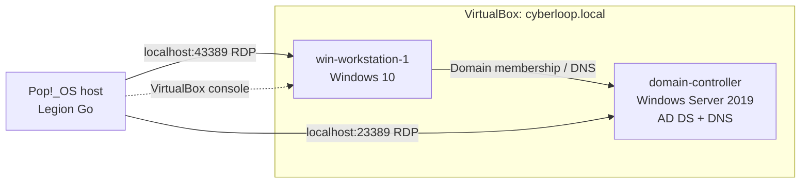

# Lab architecture

[Project overview](../README.md)

The RDP host ports above appear in the supplied captures. Vagrant also reports dynamically adjusted forwarded ports during startup, so check the active mappings when restarting the lab. This logical diagram does not assert guest IP addresses or an unverified VirtualBox network mode.

Both VMs were provisioned through Vagrant/Ansible. The notes record 1536 MB RAM and 2 vCPUs for each VM. The workstation uses the DC for domain DNS. The custom OUs are IT Support, Hospital Staff and Contractors.
