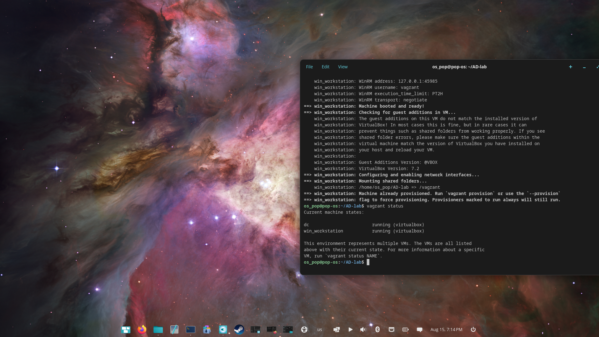
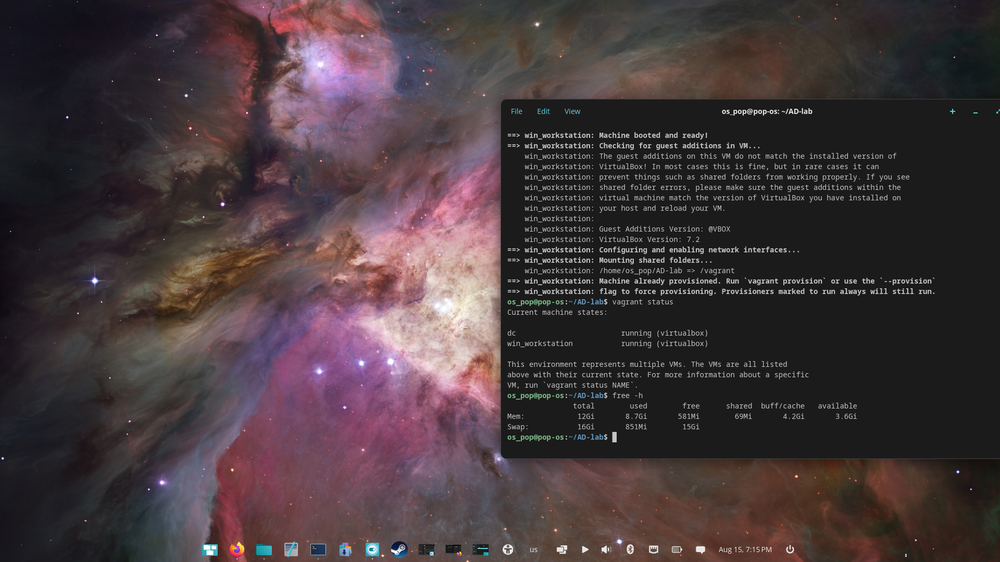
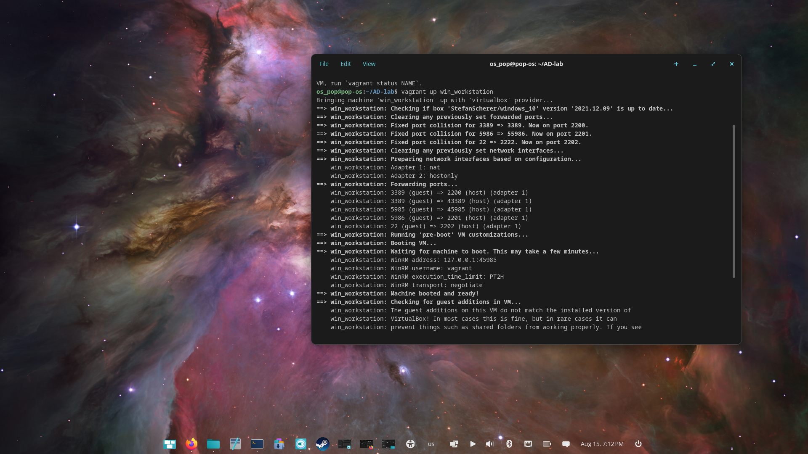

# 01 · Environment setup

[Project overview](../README.md) · [All walkthroughs](README.md)

## Objective

Run a domain controller and Windows workstation together on a memory-constrained Linux host.

## Steps performed

1. Installed VirtualBox, Vagrant, Ansible and `freerdp2-x11` on Pop!_OS.
2. Used [alebov/AD-lab](https://github.com/alebov/AD-lab) as the starting point.
3. Kept the `dc` and `win_workstation` VMs and commented out `win_server`, `ubuntu_domain` and `ubuntu_outside`.
4. Recorded a final allocation of **1536 MB RAM / 2 vCPUs per VM**. The initial 2048 MB allocation was reduced after checking available memory.
5. Started the VMs and checked their state:

```bash
vagrant up dc win_workstation
vagrant status
free -h
```

These commands were run in the original automation checkout. This documentation repository does not contain its Vagrantfile.

## Evidence



Both required VMs are running under VirtualBox.



The host reports about 12 GiB usable RAM. The build notes attribute the difference from the installed 16 GB to integrated GPU memory reservation; no BIOS change was made.



Vagrant boot output records WinRM connectivity, forwarded ports and a Guest Additions version warning.

## Result and lessons learned

The two-VM lab fit the host's available memory. Resource sizing was based on observed usable RAM. Closing an RDP viewer does not stop a VM; the VM lifecycle is managed separately with Vagrant/VirtualBox.

The notes also record unresponsive VMs after host idle/sleep. Restarting the affected VM restored access during the build; host sleep was suspected, rather than conclusively established, as the cause. Shutting down the lab cleanly before suspending the host is the recorded follow-up practice.

[Next: Domain controller](02-domain-controller.md)
