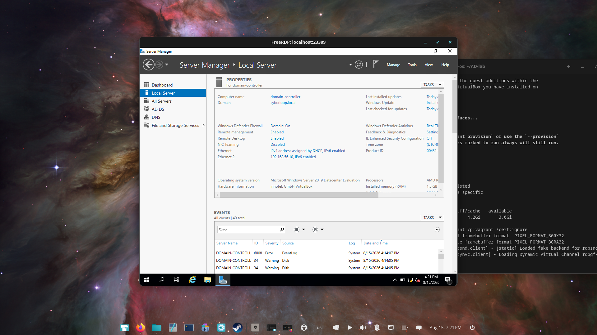
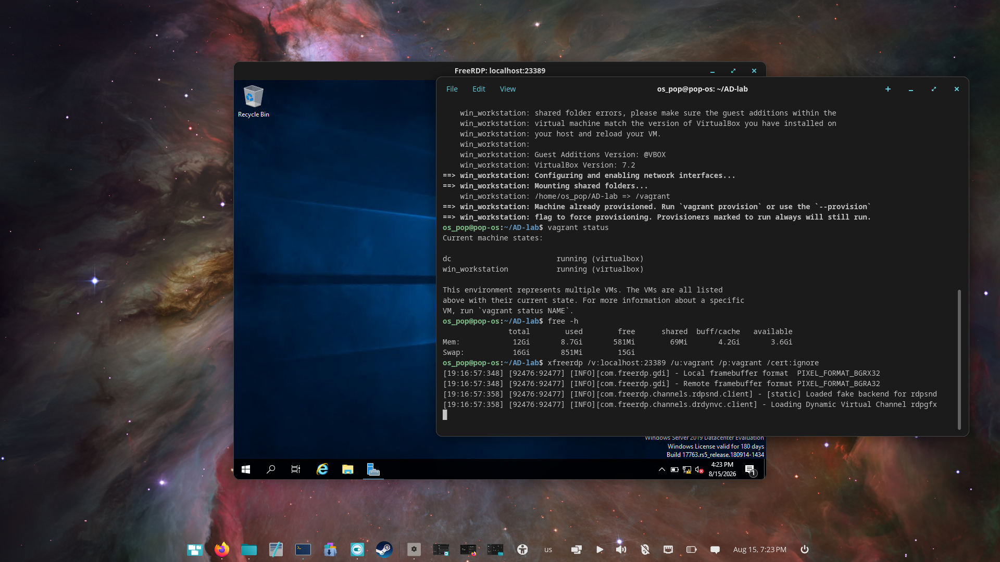

# 02 · Domain controller and provisioning fixes

[Project overview](../README.md) · [All walkthroughs](README.md)

## Objective

Provision Windows Server 2019 as the domain controller for `cyberloop.local` using the upstream Ansible automation.

## Steps performed

From the original automation checkout:

```bash
ansible-playbook -i hosts domain_controller.yml
```

The build notes record domain creation, promotion of `domain-controller`, creation of `admin`, `alice` and `bob`, and creation of the lab groups. Server Manager provides visible evidence of the resulting server configuration.

## Compatibility issues and recorded workarounds

| Issue encountered | Action taken during this build | Outcome / limitation |
| --- | --- | --- |
| Removed `ansible.windows.win_domain` module | Pinned `ansible.windows` to `2.8.0` | Kept the older playbook usable |
| Removed `community.windows.win_domain_user` module | Initially pinned `community.windows` to `2.4.0` | Later superseded by the next pin |
| PowerShell module `AcceptLicense` errors | Temporarily skipped RDP DSC tasks, then pinned `community.windows` to `1.10.0` | Notes report the module installation errors were resolved |
| Chocolatey installer required .NET Framework 4.8 | Pinned Chocolatey to `1.4.0` | Installation continued on the older Windows image |
| `sysinternals` checksum mismatch | Removed that optional package | Did not disable checksum verification |
| DNS forwarder DSC parameter errors | Added task-level `ignore_errors: yes` | Provisioning continued; forwarding was not verified |
| WinRM/RDP access problems after idle | Restarted affected VMs | Access recovered; host sleep remained a suspected cause |
| DC login after domain promotion | Used domain-qualified credentials | Recorded in the original troubleshooting notes |

These are historical compatibility workarounds for this particular build. They are not a recommendation to use old package versions for a new deployment.

The final collection pins recorded in the notes were:

```bash
ansible-galaxy collection install ansible.windows:2.8.0 --force
ansible-galaxy collection install community.windows:1.10.0 --force
```

The DNS forwarding workaround put `ignore_errors` at the task level:

```yaml
- name: Configure DNS Forwarders
  win_dsc:
    resource_name: xDnsServerSetting
    NoRecursion: false
    Forwarders:
      - "8.8.8.8"
      - "8.8.4.4"
  ignore_errors: yes
```

This allowed later tasks to run despite the failed forwarding task. A recap with `failed=0` would not mean every task succeeded when errors were ignored.

## Evidence



Server Manager shows Windows Server 2019, the `cyberloop.local` domain, and AD DS/DNS roles in the navigation.



This capture shows an RDP session and host terminal output. Its original filename was `2.1-dc-playbook-success.png`, but no Ansible `PLAY RECAP` is visible.

## Result and lessons learned

The notes report the domain controller playbook completed with `failed=0`. A recap capture and `dcdiag` output were not supplied, so a full health-check pass is not claimed here. The server screenshots and later AD administration support the documented domain deployment.

Read module errors carefully, distinguish temporary version pins from permanent fixes, and record ignored tasks as follow-up work. The detailed historical error sequence is retained in the [build notes](archive/original-build-notes.md).

[Previous: Environment](01-environment-setup.md) · [Next: Workstation domain join](03-workstation-domain-join.md)
