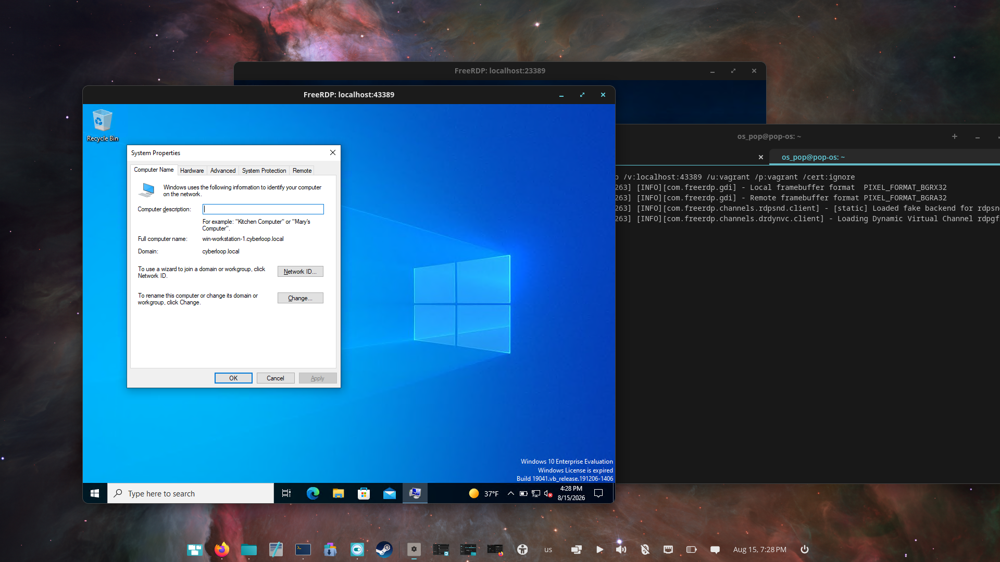
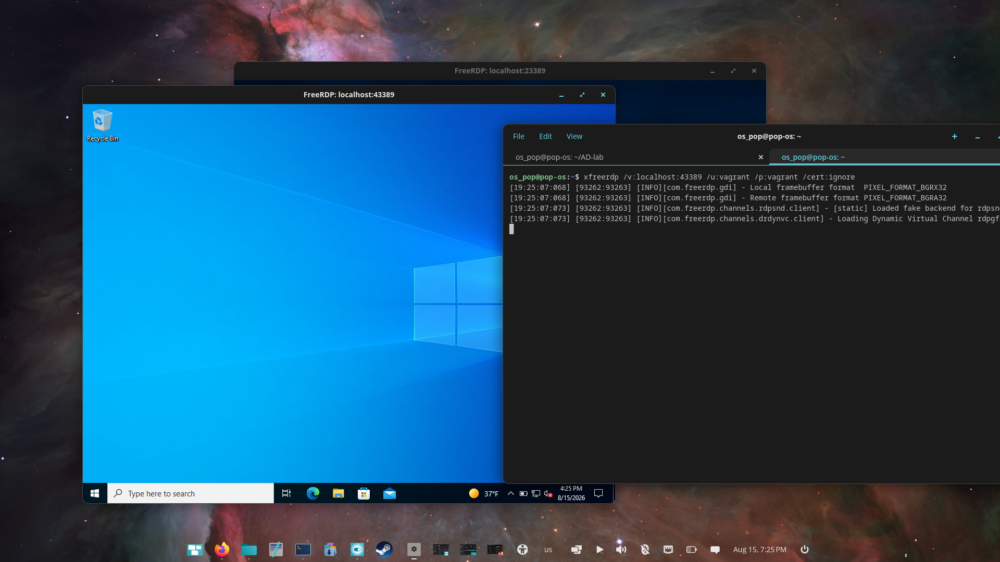
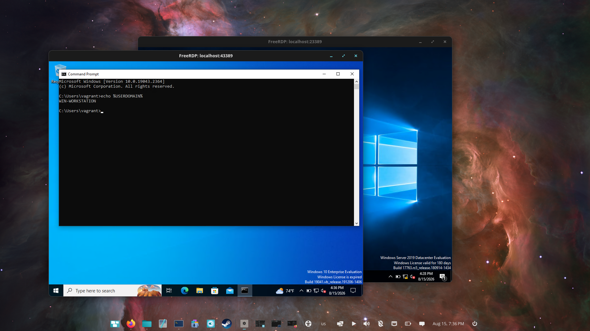

# 03 · Workstation domain join

[Project overview](../README.md) · [All walkthroughs](README.md)

## Objective

Join a Windows 10 workstation to `cyberloop.local` and verify its domain membership.

## Steps performed

From the original automation checkout:

```bash
ansible-playbook -i hosts win_workstation.yml
```

The notes record the hostname change to `win-workstation-1`, application installation, DNS configuration pointing at the DC, creation of a public network share, the domain join, and addition of `bob` as a local administrator for the lab.

Opened `sysdm.cpl` on the workstation to inspect the computer name and domain.

## Evidence



System Properties shows `win-workstation-1.cyberloop.local` and the domain `cyberloop.local`.



The workstation desktop is accessible. This file was originally named `3.1-workstation-playbook-success.png`; it does not show an Ansible recap.



The captured `echo %USERDOMAIN%` returns `WIN-WORKSTATION` in the local `vagrant` session. This describes the signed-in account context, not the computer's AD membership. The System Properties capture above is the domain-join evidence.

## Result and lessons learned

Domain membership is visible in System Properties. The playbook's `failed=0` result is recorded in the notes, but the recap image is missing. A local account can sign in on a domain-joined computer; the account context and machine membership must be checked separately.

The later [IT Tech console login](06-rdp-troubleshooting.md) provides additional evidence of a domain-user session.

[Previous: Domain controller](02-domain-controller.md) · [Next: Users, groups and OUs](04-users-groups-and-ous.md)
