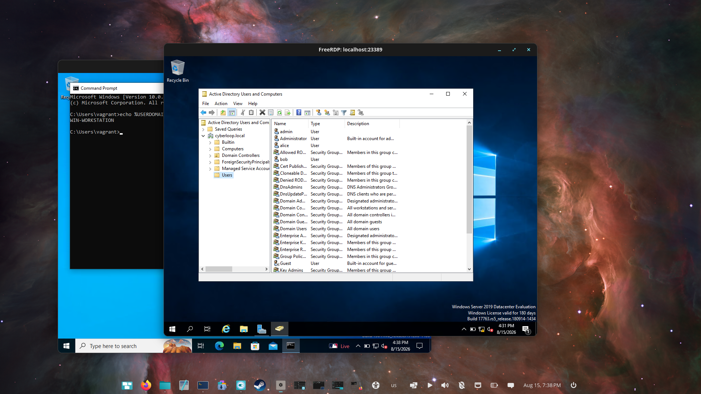
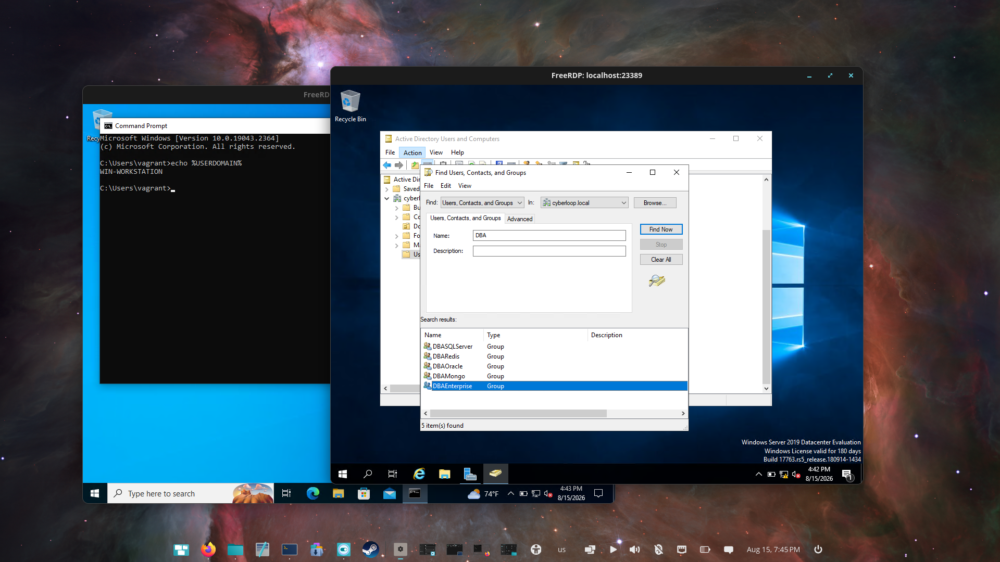
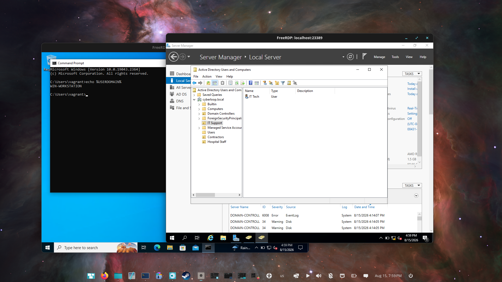
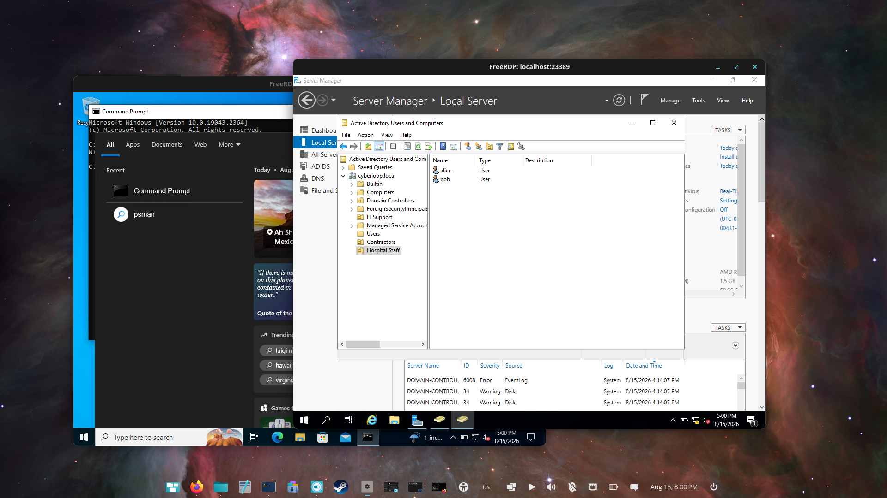
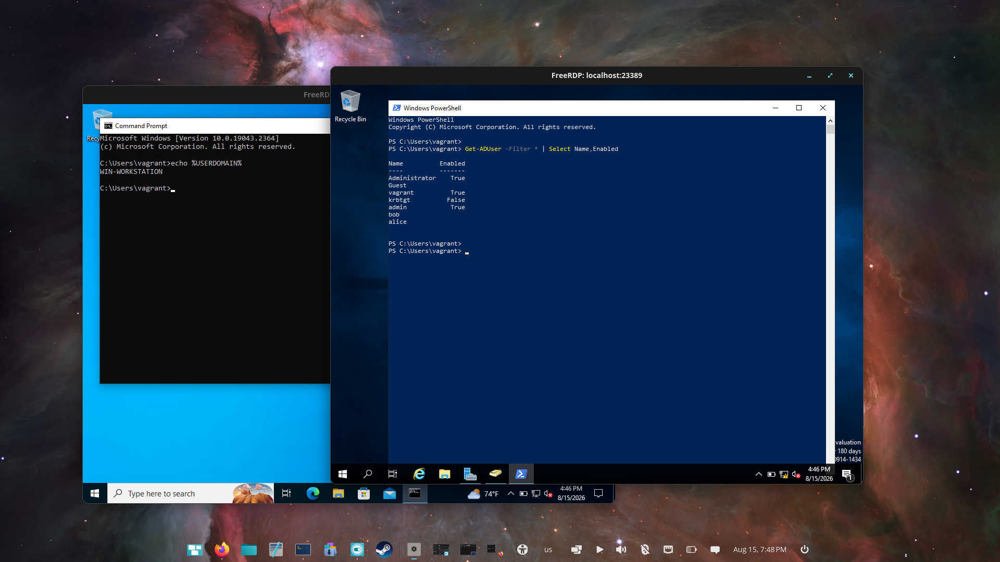

# 04 · Users, groups and organizational units

[Project overview](../README.md) · [All walkthroughs](README.md)

## Objective

Practice directory administration with a department-style OU structure and test accounts.

## Steps performed

- Reviewed users and groups in Active Directory Users and Computers (`dsa.msc`).
- Created **IT Support**, **Hospital Staff** and **Contractors** OUs.
- Created the `IT Tech` / `ittech` test account inside IT Support.
- Inspected group search results and queried accounts with PowerShell.

The build notes list the provisioned groups as `AllTeams`, `DBAOracle`, `DBASQLServer`, `DBAMongo`, `DBARedis`, `DBAEnterprise` and `Test Group`.

## Evidence



The Users container includes lab accounts and built-in directory objects.



The Find dialog lists matching DBA groups.


The directory contains IT Support, Hospital Staff and Contractors OUs.



The IT Support OU contains the IT Tech test user.



The Hospital Staff OU shows `alice` and `bob`.


The Contractors OU contains a contractor test account.



The captured command checks account names and enabled state:

```powershell
Get-ADUser -Filter * | Select Name,Enabled
```

## Result and lessons learned

The screenshots show the custom structure and test accounts, with both GUI and PowerShell inspection. These are synthetic home-lab accounts and organizational labels, not a production directory.

An OU organizes objects and can be used to scope GPO links; a security group represents membership used for permissions. Creating a domain account alone does not establish its remote-login permissions.

[Previous: Domain join](03-workstation-domain-join.md) · [Next: Group Policy](05-group-policy.md)
