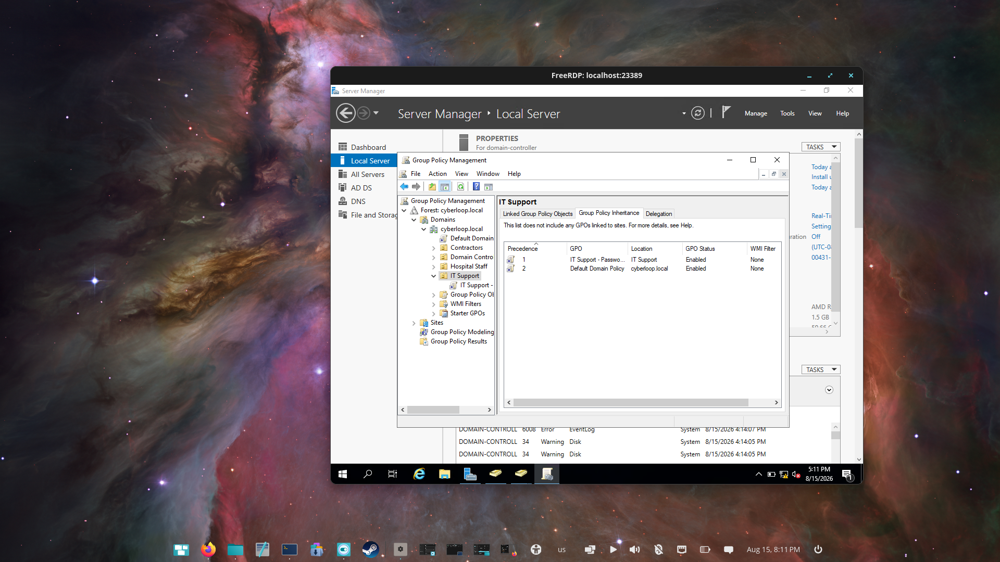
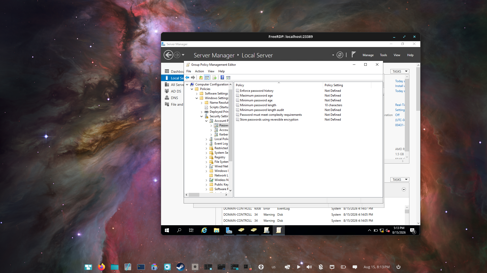
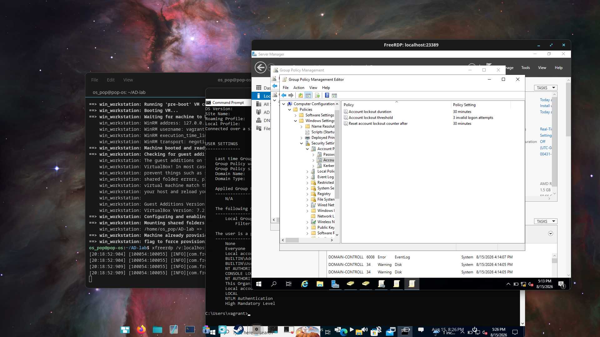
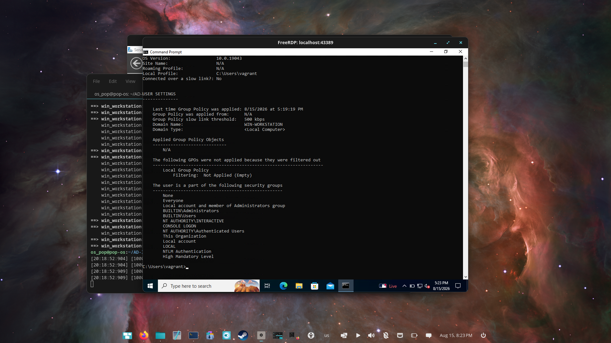

# 05 · Group Policy configuration and verification

[Project overview](../README.md) · [All walkthroughs](README.md)

## Objective

Practice creating and linking a GPO, editing password/account-lockout settings, and inspecting policy results.

## Steps performed

The notes record a GPO named **IT Support - Password Policy**, linked to the IT Support OU. The screenshots show GPO management, password settings, account-lockout settings and a `gpresult` report.

The notes also record running:

```cmd
gpupdate /force
gpresult /r
```

## Evidence



Group Policy Management shows the IT Support policy in the OU's policy view.



The captured minimum password length is **10 characters**. Other visible password settings are Not Defined.



The capture shows **3 invalid logon attempts**, **30 minutes** lockout duration and **30 minutes** before resetting the counter. Earlier notes describe a one-attempt test; that state is not captured in the supplied evidence.



The report shows `C:\Users\vagrant`, domain type **Local Computer**, and **N/A** under applied GPOs in the visible user section. It does not demonstrate application of the IT Support GPO to a domain user.

## What this establishes

The evidence establishes GPO configuration and inspection. Effective enforcement of the intended domain-user password/lockout policy remains unverified.

Domain-account password policy is set at domain scope. Linking password settings to a user OU does not create a separate domain-user password policy for that OU. For different policies for selected users or global security groups, use fine-grained password policies. See Microsoft's [Password Policy documentation](https://learn.microsoft.com/en-us/previous-versions/windows/it-pro/windows-10/security/threat-protection/security-policy-settings/password-policy) and [fine-grained password-policy guide](https://learn.microsoft.com/en-us/windows-server/identity/ad-ds/get-started/adac/fine-grained-password-policies).

## Next verification steps — not yet performed

From an appropriate AD administration session, inspect the default and any resultant fine-grained policy:

```powershell
Get-ADDefaultDomainPasswordPolicy
Get-ADUserResultantPasswordPolicy -Identity ittech
```

If no resultant fine-grained policy is returned, check the default domain policy. Capture policy results in the intended domain-user/computer context and separately verify password-policy scope before attributing login failures to a GPO.

## Lesson learned

A configured setting and a linked GPO are not sufficient proof of effective policy. Verify the account context, scope and resultant settings.

[Previous: Directory administration](04-users-groups-and-ous.md) · [Next: RDP investigation](06-rdp-troubleshooting.md)
