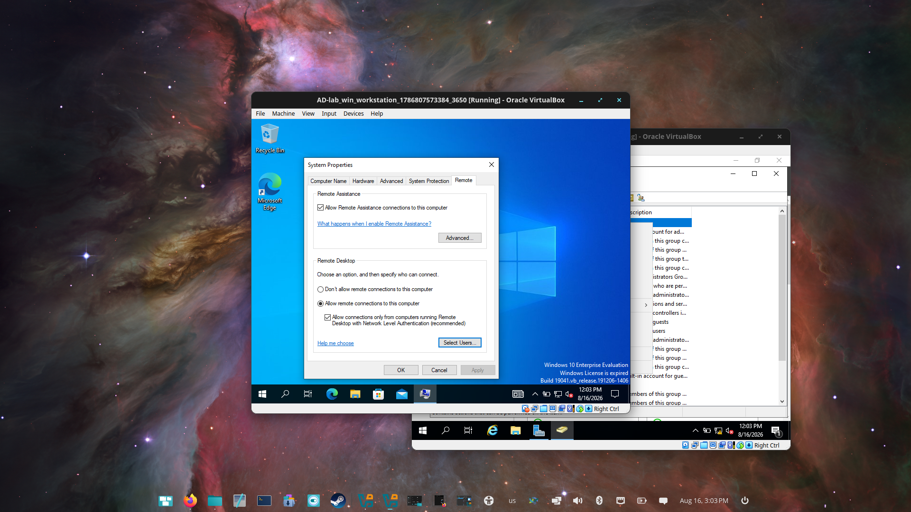
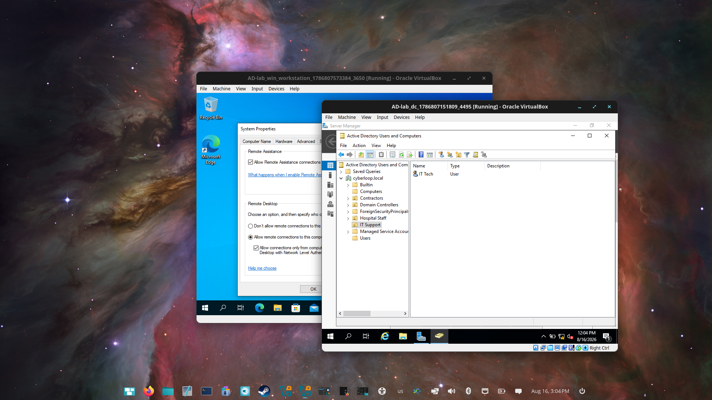
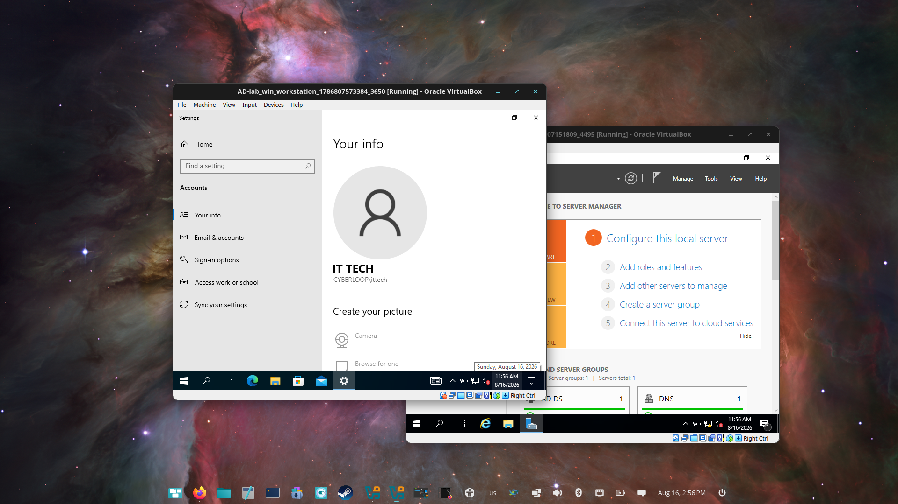
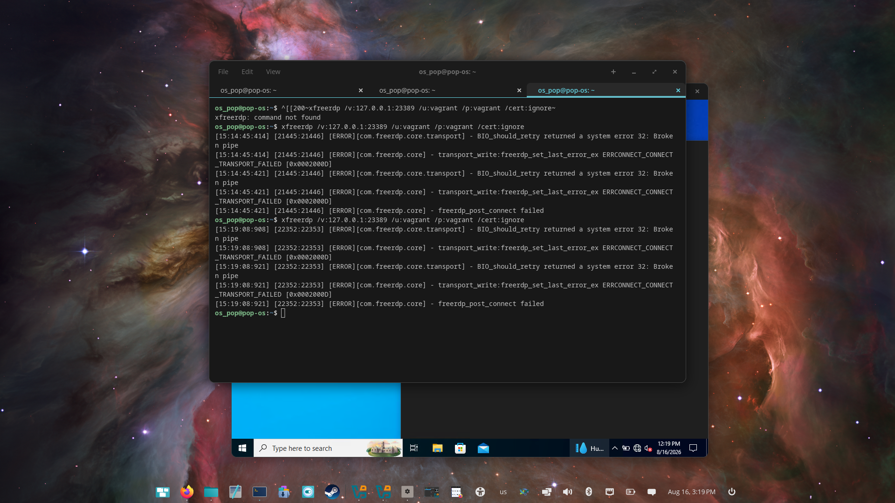

# 06 · RDP access investigation

[Project overview](../README.md) · [All walkthroughs](README.md)

**Status: investigated; RDP root cause and final fix remain unconfirmed.**

## Problem

The build notes report that the new domain user `CYBERLOOP\ittech` could not sign in to the workstation over RDP. Errors recorded in the notes included `STATUS_LOGON_FAILURE` and, at one point, `STATUS_PASSWORD_MUST_CHANGE`. Other-account RDP access was available during the investigation.

## Diagnostic steps recorded

| Step | Action | Observation / interpretation |
| --- | --- | --- |
| 1 | Compared connectivity with other accounts | Broad availability could be checked separately from this user's login |
| 2 | Reset the test account password | Reduced uncertainty about the entered credentials |
| 3 | Inspected account lockout and password-change flags in ADUC | Account-status checks are recorded in the notes; their dialog was not captured |
| 4 | Checked permitted RDP users and added `ittech` | Notes report the account was missing; the membership dialog was not captured |
| 5 | Retried RDP | Login still failed after the membership change |
| 6 | Signed in through the VirtualBox console | A console session as `CYBERLOOP\ittech` succeeded |

These steps narrowed the investigation toward differences between interactive and remote sign-in. They do not establish NLA as the root cause or rule out all account/policy conditions.

## Evidence

The Remote tab shows remote-access settings. It does not show the Select Users membership list, so the account addition is supported by the notes rather than this image.

IT Tech is visible in the IT Support OU. The image does not expose the account's lockout or password-change flags.

Windows Settings shows **IT TECH / CYBERLOOP\ittech** in a VirtualBox console session. This supports successful console sign-in at that point in the investigation.

### Separate connection failure captured during the lab

This terminal capture shows `ERRCONNECT_CONNECT_TRANSPORT_FAILED` for the `vagrant` account connecting to `127.0.0.1:23389` (the DC endpoint). It is retained as an additional troubleshooting artifact, not as a screenshot of the reported `ittech` workstation authentication failure.

## Outcome

Console access was demonstrated, and an RDP membership issue was reported as corrected. RDP still failed, so the investigation remains open. The [GPO screenshots](05-group-policy.md) also do not prove a lockout policy caused the failure.

## Next checks — not yet performed

1. Reproduce the workstation failure using the domain-qualified account and capture the exact error/time.
2. Inspect effective **Allow log on through Remote Desktop Services** and **Deny log on through Remote Desktop Services** rights, alongside local group membership.
3. Correlate the failed attempt with workstation/DC security events and Remote Desktop Services logs.
4. Recheck password-change requirements and effective account policy, then investigate NLA behavior using the collected evidence.
5. Retest RDP after the confirmed fix and capture the successful domain-user remote session.

## Lessons learned

Compare console and remote sign-in early, separate connectivity from authorization/authentication, and capture the exact dialogs and logs used in diagnosis. Documenting an unresolved investigation accurately makes the next troubleshooting session more efficient.

[Previous: Group Policy](05-group-policy.md) · [Return to project overview](../README.md)
